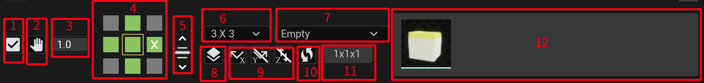
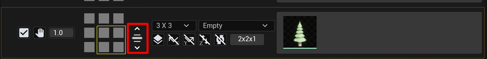
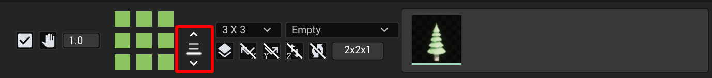
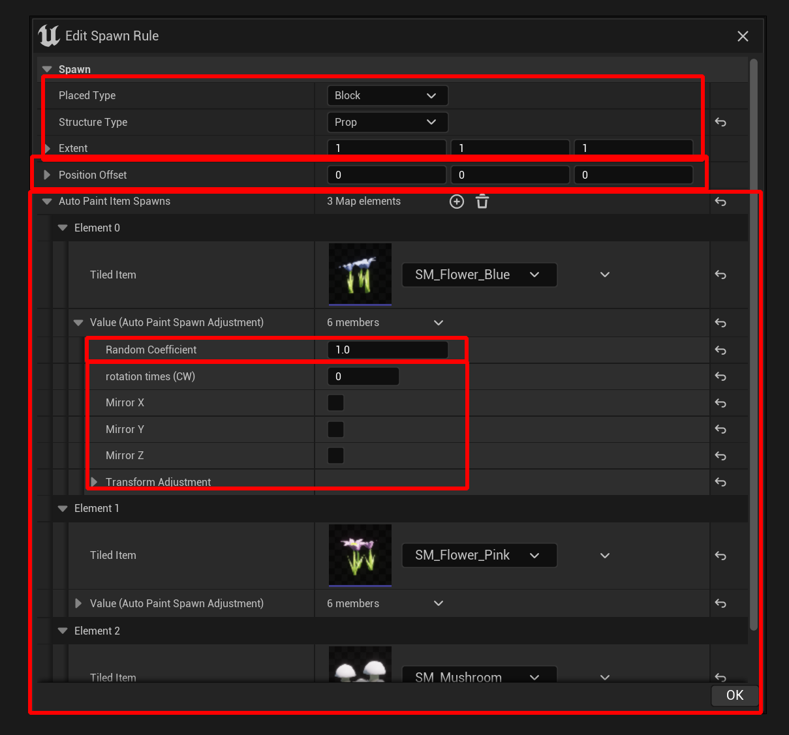
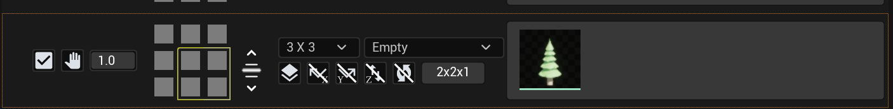

# Rule detail

<!-- The algorithm will check all positions in your tiled level to see which rule it met. When rule is met, it will spawn the target tiled items at given position. -->

## overview

(V3.0.2)

Here are the options for any rule you need to configure.

#### 1. Enabled
Whether to enable this rule. There is also a enabling button in group row.

#### 2. Stop on met
Stop here when rule is met.
Whether stop checking rule with lower order than this one if it is met. If you want to spawn multiple instance at some place, you could turn it off.

#### 3. Rule apply probability
The probability that whether this rule will apply. You can introduce some randomness by this parameter. 

#### 4. edit adjacency rule

Select an auto paint item and click on any of the grids to set adjacency rule.
Hover mouse above the position to set adjacency and:

> After select active auto paint item (except empty): 
**Left mouse click**: set as selected item. 
**Shift + left mouse click**: set as **NOT this item**. 

> Select Empty item or select nothing: 
**Left mouse click**: set hovered position as empty. 
**Shift + left mouse click**: set it as **NOT EMPTY**. 

> **Middle mouse click**: set as EMPTY.

- **Not this item**: this position must not be painted with this item. It's acceptable for any other item or empty.
- **Not empty**: this position must be painted with anything.
- **Empty**: this position must be empty.

You can visualize it in test paint viewport.

#### 5. Floor switch for adjacency rule editor
Change different floor to edit adjacency rule. Will be invisible if **enable multiple floors** is not checked.

adjacency rule in the same floor 

adjacency rule in the below floor 

#### 6. Impact Size
Define the surrounding size that may affect whether this rule will meet. Options includes 1x1 , 3x3, and 5x5.

#### 7. Boundary Rule
Choose what to handle when impact size is out of boundary. This will happen at the edge of your level when impact size is bigger than 1x1.

Options include: Empty, not applicable, and each auto paint item.

---

Detailed explain

<!-- During checking rule from adjacency rule, what should it handle when the impact size is out of boundar -->
Assuming, you have a tiled level with size **4x4x1**, and the impact size for your rule is **3x3**. 
Then when checking rule on the edge part of this level, it does not contain enough space. It's out of boundary.  
OOOO 
OOOO 
OOOO 
OOOO 
When checking adjacency rule on the green position (0,0), it required the 9 points surrounding it to check adjacency. It's obviously not possible.

Here's how the algorithm handles it: 
When you choose out of boundary as empty or anything, then it will add extra padding with this item during rule checking:  
OOOOOO 
OOOOOO 
OOOOOO 
OOOOOO 
OOOOOO 
OOOOOO 

If you choose **not applicable**, then this rule will always fail when this situation happen.

---

#### 8. Enable Mutiple Floors
Enable multiple floors for adjacency rules. Add extra dimensiotn for impact size. Ex: 3x3 become 3x3x3.

#### 9. Mirror rules to X, Y, or Z
Auto generate mirrored version for the adjacency rules you edit. Check out the preview screen for the mirrored versions of the adjacency rule.

adjacency rule visualization with X,Y mirrored cases: 

#### 10. Auto Rotate to Mirror
Whether should auto rotate your item when mirror rule is applied. I've settup the best possible rotation pattern to match the mirrored case, however, in many cases, you still need to manually choose the proper rotation.

#### 11. Step Size editor
Change step size to further restrict positions where this rule would apply. 
By default, the rule checking process will scan all positions in your tiled level. You can set it scan on only every X rows, Y columns, or Z floors, ex: The size of your tiled level is 4x4x1, the step size of this rule is 2x2x1, and step offset is 1x0x0, then rule could only apply on these points: 
OOOO 
OOOO 
OOOO 
OOOO

#### 12. Spawn Rule editor
Click this button to open spawn rule editor. It will also show registered tiled items to spawn.

Spawn rule details: 

Choose the tiled items with these specific properties to spawn:
* Placed type
* Structure type
* Extent

By default, item will spawn at center. You can offset it by:
* Position offset

* Auto paint item spawns
Array of tiled items to spawn. 
When this array contains multiple items, it will pick one of them to spawn based on **Random Coefficient**. 
You can also set rotation, mirror XYZ, and additional transform adjustment to what to spawn. 

> The placed type only supports **Block type** for now (V3.0.2).

> The yellow box indicates where the items will spawn. It's affected by **Extent** and **Position offset**. 

