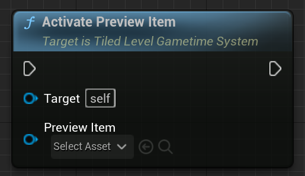

# Tiled level in Gametime - API
## Activate Preview Item

Activate preview item and move it to current position. You can use Query Item by UID to get the item to preview. The preview material is setup in target Tiled Level Gametime System.

### > Input
|             |         |       |
| :---        | :----   | : --- |
| Preview Item | Tiled Item Object Reference | The item that will be previewed |

### > Output

