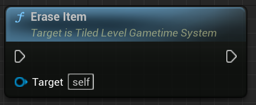

# Tiled level in Gametime - API
## Erase Item

Eraser item at current tile position and extent.

> (V2.0.1) The CanRemoveItem has no effect on eraser now. This will be fixed in next update!

### > Input

### > Output
