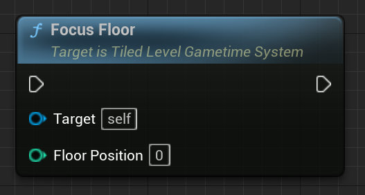

# Tiled level in Gametime - API
## Focus Floor

Hide all placements in other floors, make you focus on this floor only.

### > Input
|             |         |       |
| :---        | :----   | : --- |
| Floor Position | Integer | The floor position to focus. |

### > Output

