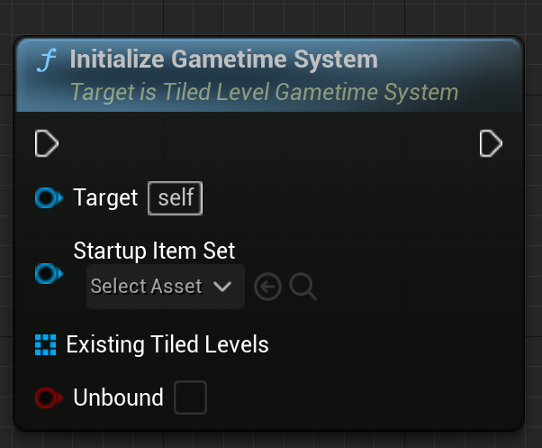

# Tiled level in Gametime - API
## Initialize Gametime System

Must initialize to enable the entire system. Will apply required transformation to existing tiled levels. If there are overlap between existing levels, the intialization may fail. If unbound is false, the functionality of this system will bound to the extent of each existing tiled Levels. 

### > Input
|             |         |       |
| :---        | :----   | : --- |
| Startup Item Set| Tiled Item Set Object Reference | Must have same tile size, otherwise, initialization will fail. |
| Existing Tiled Levels| Array of Tiled Level Object References | Array of existing levels you want to include in this system. |
| Unbound | Boolean|  Should the system work infinitely? Or bound to the extend of included tiled levels?|

### > Output
