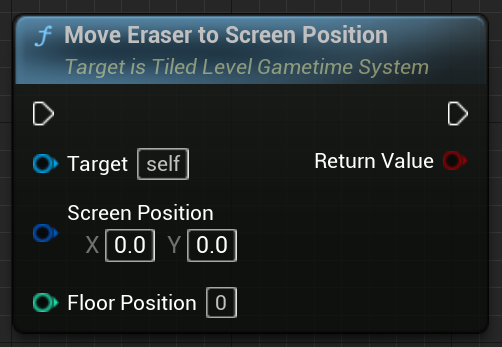

# Tiled level in Gametime - API
## Move Preview Item to Screen Position

Must activate eraser beforehand. Floor position is required. Convert the input screen postion to **tile position** and then try to move eraser there. If the converted **tile position** is not inside the boundary or is still inside same tile position, it won't move.

### > Input
|             |         |       |
| :---        | :----   | : --- |
| Screen Position | Vector 2D structure | The position on current screen. (0, 0) is the top left corner.  |
| Floor Position| Integer | 0 means 1F, -1 means B1. |

### > Output

|               |         |       |
| :---          | :----   | : --- |
| Return Value  | Boolean |  True if the eraser is actually moved. |
