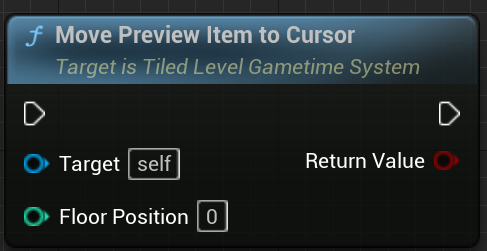

# Tiled level in Gametime - API
## Move Preview Item to Cursor

Let the preview item follow your cursor. Must activate preview item beforehand. Convert the cursor position to **tile position** and then try to move preivew item there. If the converted **tile position** is not inside the boundary or still inside same tile position, it won't move.

> (V2.0.1) Will add new parameter to specify the player index in next update. Now, it will move to cursor position from the first player.

### > Input
|             |         |       |
| :---        | :----   | : --- |
| Floor Position| Integer | 0 means 1F, -1 means B1. |

### > Output

|               |         |       |
| :---          | :----   | : --- |
| Return Value  | Boolean |  True if the preview item is actually moved. |
