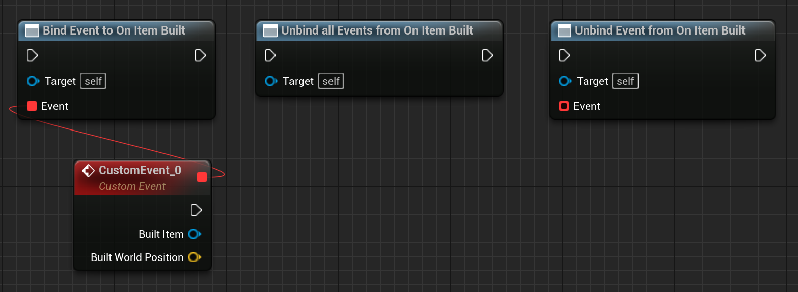

# Tiled level in Gametime - API
## On Item Built

**EVENT DISPATCHER**

Triggered after item is built. You can bind custom events anywhere, ex: calculate resource cost, spawn particle, or play sound. 

### > Inputs for binding
|             |         |       |
| :---        | :----   | : --- |
|  | Tiled Item Object Reference | The item that is just built. |
|  | Vector | The world position where the item is built |
