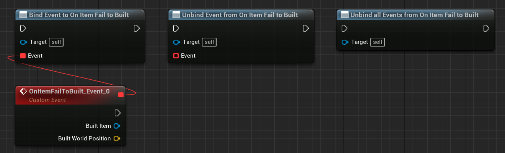

# Tiled level in Gametime - API
## On Item Fail to Built

**EVENT DISPATCHER**

Triggered after failure to build item. You can bind custom events anywhere, ex: spawn particle, or play sound. 

### > Inputs for binding 
|             |         |       |
| :---        | :----   | : --- |
|  | Tiled Item Object Reference | The item that is just failed to build. |
|  | Vector | The world position where the item is about to build but fail. |
