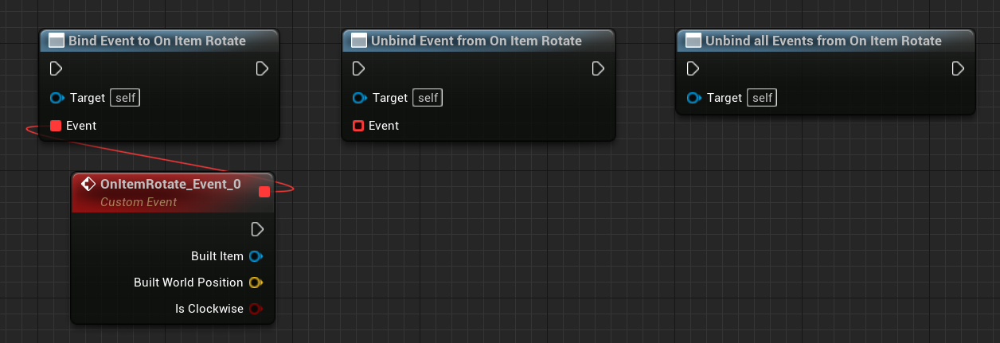

# Tiled level in Gametime - API
## On Item Rotate

**EVENT DISPATCHER**

Triggered after preview item is rotated. You can bind custom events anywhere, ex: spawn particle or play sound. 

### > Inputs for binding
|             |         |       |
| :---        | :----   | : --- |
|  | Tiled Item Object Reference | The item that is just built. |
|  | Vector  | The world position of the preview item |
|  | Boolean | Is rotated in clockwise? |
