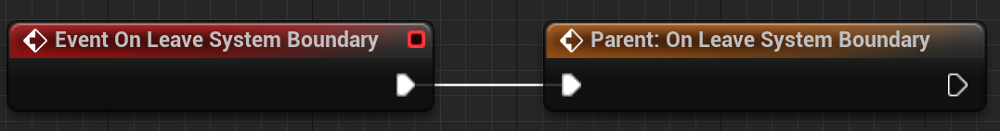

# Tiled level in Gametime - API
## On Leave System Boundary

**EVENT**

Triggered whenever move tile position outside the boundary. By default, it will just call **Deactivate Preview Item**. You can override it or extend its functionality as you wish. 

### > Input

### > Output

