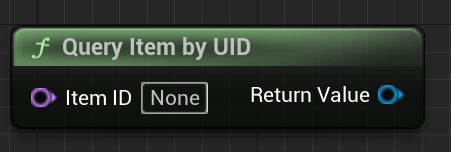

# Tiled level in Gametime - API
## Query Item by UID

Search the tiled item object reference inside current **item set** by matched UID.

### > Input
|             |         |       |
| :---        | :----   | : --- |
| Item ID | Name | The GUID (converted to name) of the item you want to query.  |

### > Output

|               |         |       |
| :---          | :----   | : --- |
| Return Value  | Tiled Item Object Reference |  Found item reference. |
