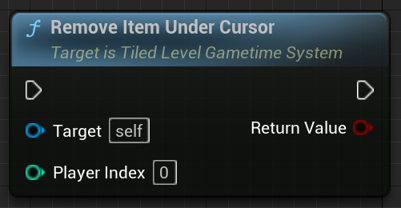

# Tiled level in Gametime - API
## Remove Item Under Cursor

Use the hit result under cursor to detect and remove item placement.

### > Input
|             |         |       |
| :---        | :----   | : --- |
| Player Index| Integer | The player index who is controlling the cursor |

### > Output

|               |         |       |
| :---          | :----   | : --- |
| Return Value  | Boolean |  Is an item placement removed? |
