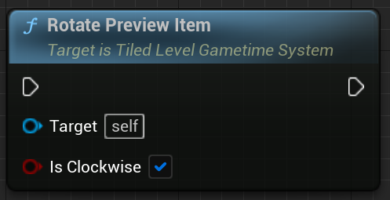

# Tiled level in Gametime - API
## Rotate Preview Item

Must activate preview item beforehand. Rotate preview item at current tile position.

### > Input
|             |         |       |
| :---        | :----   | : --- |
| Is Clockwise| Boolean | Rotate in clockwise or counter-clockwise direction? |

### > Output

