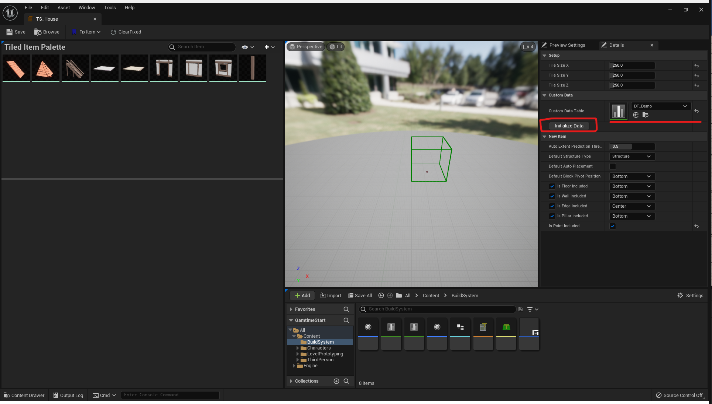
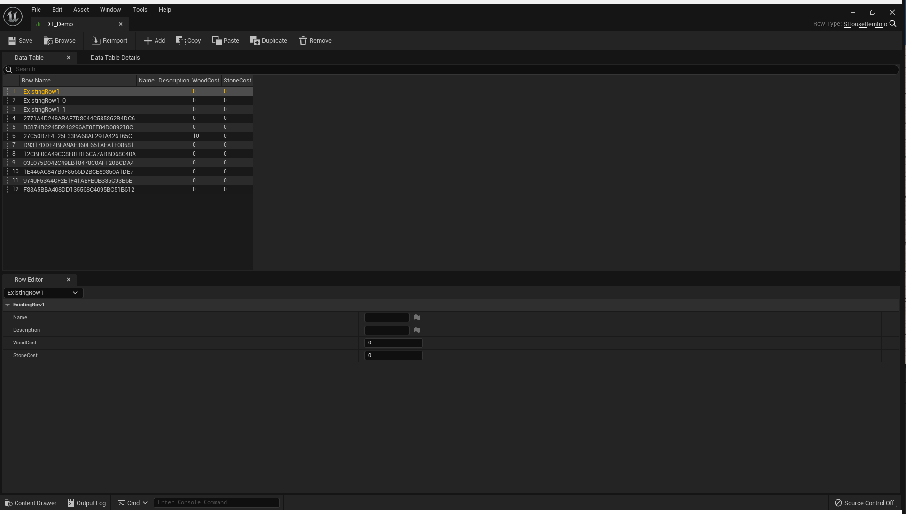
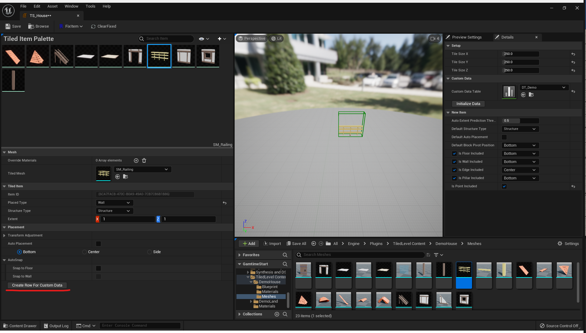
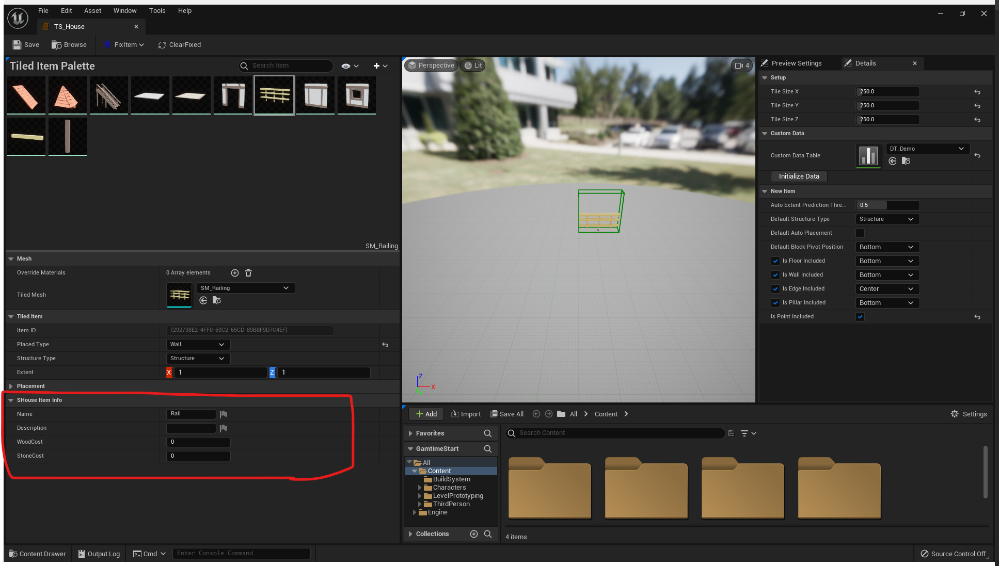

# Tiled level in Gametime - Custom data binding

To support custom data binding, all you need to do is to create your data table with a **KEY** variable that can link to the tiled items inside your **tiled item set**. This plugin provides an automatic approach to help you make such linkage. The **GUID** in each tiled item will become the **RowName** in your data table.

1. Make linkage

Set the data table and click **Initialize Data**. New empty rows will populate with RowName the same as item ID, while existing rows will stay unchanged.

If you add new item to item set after setup this linkage, just click **Create Row For Custom Data** and the new row will generate in your data table.

2. Edit inside **tiled item set**

As the linkage is setup properly, you can edit the data just below the detail panel for each item. It's much intuitive to come up with descriptions for these items now.

3. Query it for what you want.

Now you can easily query the data for your needs. EX: Check whether resource cost is affordable.

> Edit the data in **data table editor** and in **tiled item set editor** at the same time may occasionally crash the editor. Once the linkage is made, you should just work in **tiled item set editor**.