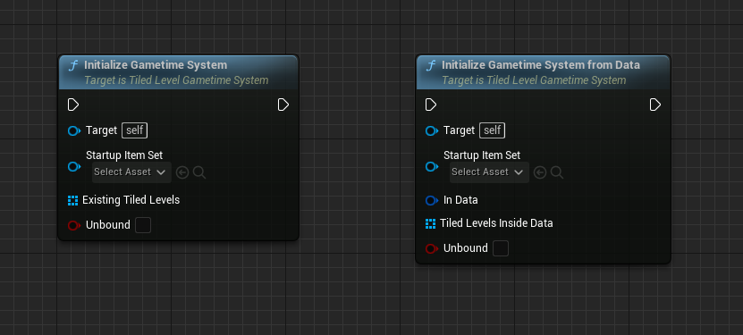
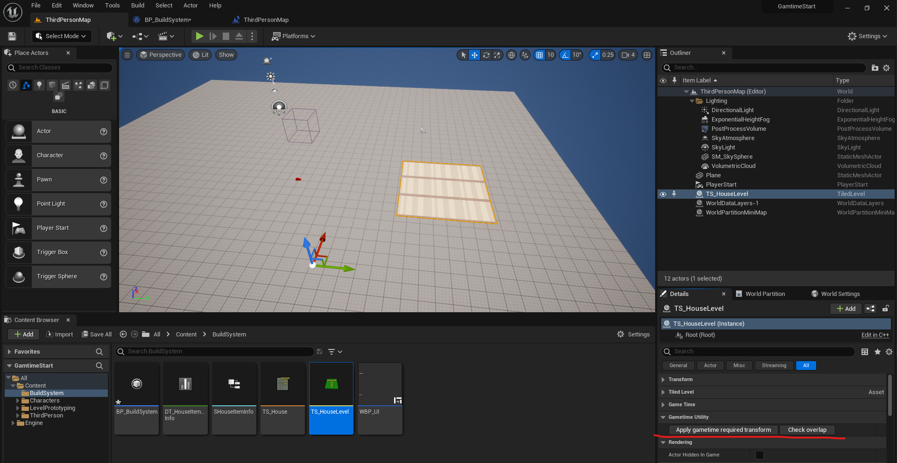

# Tiled level in Gametime - Initialization

To use the gametime support features, you should first create your system which inherited from *TiledLevelGametimeSystem*. It's a Gameinstance Subsystem, an extremely useful feature that Unreal Engine provides. Check out the [Programming Subsystems](https://docs.unrealengine.com/4.27/en-US/ProgrammingAndScripting/Subsystems/) if you are not familiar with. After you create your system, you need to configure it properly to meet your needs. Finally, you need to initialize the system with proper parameters. The initialization is the step mentioned last in the quick tutorial, but it is actually the most important node to run.

### System configuration
- Tile Size 
	The tile size you want to use across the entire system, affecting all placement rules. Besides, during **initialization**, the input **item set** must have the same tile size. Otherwise, the system will fail to initialize, and so do the rest functions.
- Preview materials  
	If turn off should use preview material, it will just show the original material from that item as *CanBuildHere* material and hide that item as a visual hint for disallowing to build here. If the preview materials are not provided, it will apply the default preview material from the plugin.	
- Restriction 
	In case you want to block building or removing except inside the explicitly allowed area, turn on these variable. Check out [Restriction Area](GameTime/RestrictionArea).
	

### Initialization

There are two nodes handling initialization: *InitializeGametimeSystem* and *InitializeGametimeSystemFromData*. You can call them any place you want, but I suggest you put them inside Level Blueprint to easier get access to reference to existing levels.

- Startup Item Set 
	If the tile size of the input **item set** differs from the system, the initialize will fail.
- Existing Tiled Levels 
	You may include existing tiled levels to be controlled by this system. No overlapping between existing tiled levels is allowed, and will lead to failure to initialize.
- Unbound 
	If false, the system will only work inside the extent of included existing tiled levels.
---	
- InData 
	Check out [Save & Load].
- Tiled Level Inside Data 
	If that existing level is already inside data, you should still specify them here.	

> Maybe I should add some info to show you whether the system is initialized properly.

#### Setup Existing levels

To align the location of existing levels, some transformation are applied during initialization. You can just click **Apply gametime required transform** to let it transform that way beforehand. To address to the overlap issue, you can click **Check overlap** to examine, and then manually adjust their locations. 
