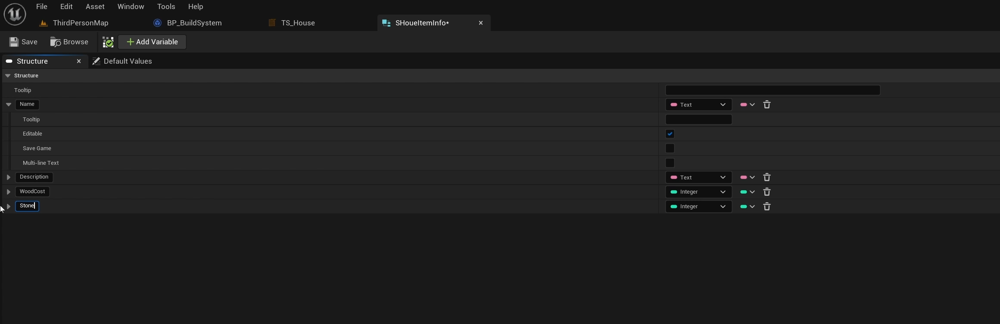
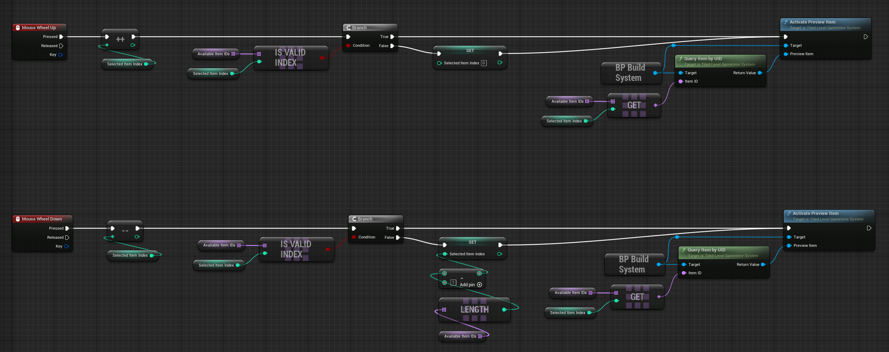
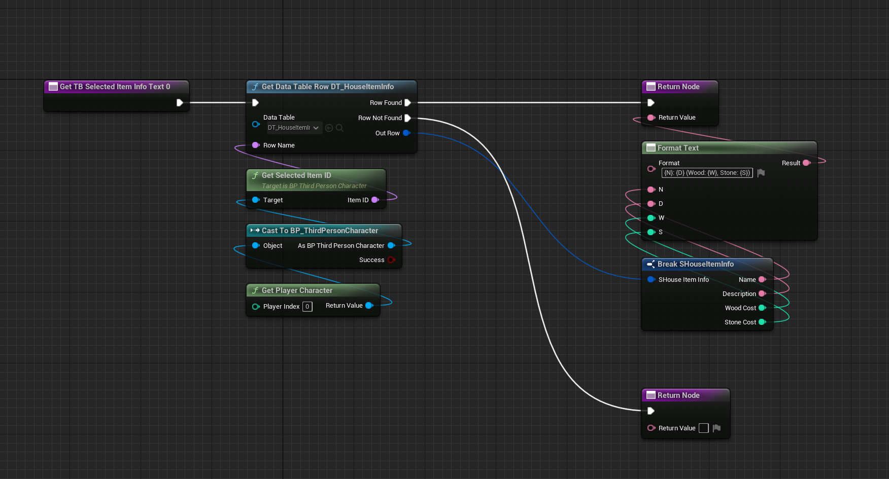

# Tiled level in Gametime - Quick start

In this quick start, we are going to build a simple resource-based building system with UE5.0, default third person template, and this plugin.
This system contains these features:

1. Can choose what to build
2. Show the preview item, and move it in front of the character
3. Allow play to rotate the preview item
4. Automatic check if resources are enough to build that item when trying to build.
5. Automatic calculate resources cost when item is built.

---

**video tutorial (no text explanation for now)**

---

  
### Project Startup
Create a new project with the **Third Person** template.

Activate tiled level plugin, check its version is >= V2.0.0.

Clean up the default map by removing all existing meshes, and put a simple plane as floor and scale it to [50, 50, 1] (or larger). Set the location of the plane to [0, 0, 0] to match the default start z location of the system. You may set a better looking material for that floor plane.

  

### Create and setup the build system blueprint
Create a blueprint inherited from **TiledlevelGametimeSystem**. It's a *UGameInstanceSubsystem* that you can get access to it everywhere with life span across the whole game play. Check out the [Programming Subsystems](https://docs.unrealengine.com/4.27/en-US/ProgrammingAndScripting/Subsystems/) if you are not familiar with. Rename the blueprint as **BP_BuildSystem**. 

Inside class default, set tile size as [250, 250, 250], and create new integer variable **Wood** and **Stone** as the current resources. Set their default value to 100. 

That's it for now. Leave the rest program after setup **Item Set** and its associated custom data.
  

### Create Item Set and custom data
Create a new item set called **TS_House**, set tile size to [250, 250, 250], and add a few meshes from *HousePack* (Plugin/TiledLevel/DemoHouse/Meshes).

Create a Structure called **SHouseItemInfo**. Create 4 variables: Name (Text), Description (Text), WoodCost (integer), and StoneCost (integer). 

Create a Data Table called **DT_HouseItemInfo** with its row structure as **SHouseItemInfo**. There is no need to edit any content for this data table, just close it.

 Under **TS_House** set the *custom data table* to **DT_HouseItemInfo** and click *Initialize Data*. 

Now, the linkage between the **TS_House** and **DT_HouseItemInfo** is established with *ItemID* as the row name. You can just fill the custom info inside the item set and the data will be stored in the data table.

With these setup, you can just query the row data by the *ItemID* everywhere you want. After filling the custom info for each item, the setup at this stage is completed.

> Known crash issue (V2.0.0): Modify the Structure and go back to its associated opened Item Set will crash the editor for now. You should close the Item Set before modify the Struct.

 

### Finish build system blueprint
With custom data properly setup, we can continue the rest logic in **BP_BuildSystem**.  Override two functions: **Begin System** and **CanBuildItem**. 
For **CanBuildItem** create the logic to check whether current resources is enough to build that particular item.

After **Begin System**, bind a custom event to **OnItemBuilt** to add a simple logic to subtract resource cost for the newly built item.

For more information, check out [Event bindings](GameTime/Events).   

### Setup character control
Open **BP_ThirdPersonCharacter** and create the following logic.
Add **Begin Play**, promote table row names from **DT_HouseItemInfo** to a private variable *AvailableItemIDs*.

Add input event **Wheel up** and **Wheel down** to implement how to choose item and activated them. Create a integer variable *SelectedItemIDIndex* and follows the graph below.

Add input event **Left Mouse Button** to build item. 
Add input event **R** to rotate preview item. 
Add input event **Right Mouse Button** to deactivate preview item.

Last, you need to let the preview item move along with the character. Add **Tick** and calculate the forward 250 cm to move the preview item.

Add a pure function (*GetSelectedItemID*) to make access of selected item name easier.

### Create basic UI
Create an UserWidget called **WBP_UI**. Place 2 TextBlock in canvas, and bind their GetText function as below.

Enable this widget in **BP_ThirdPersonCharacter**.

### Initialize the system
In level blueprint (or anywhere you like) call *Initialize Gametime System* and set Startup Item Set as **TS_House** and set *Unbound* true.

### Done!
Now hit play and have fun!

> Known issues: Packaging this game will fail by current version (2.0.0)! I've fixed in the developing branch, but some other minor issues still exist. I will submit a thorough fix ASAP.

