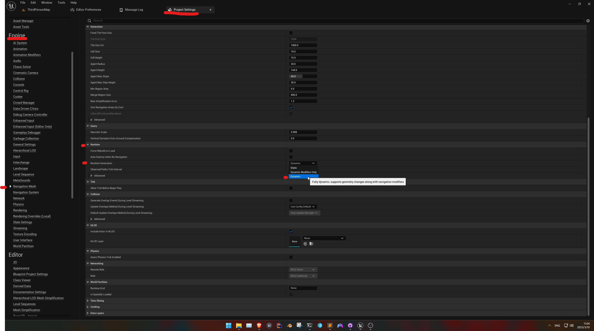

# Tiled level in Gametime - AI navigation 

If you want your AI agent update its navigation path in response to Build / Remove item in runtime. Like this:

[youtube video](https://www.youtube.com/embed/NSxTagoVZvk ':include :type=iframe width=560px height=315px')


All you need to do is to set runtime generation for nav mesh as dynamic.

```
Edit > Project Settings > Navgation Mesh > Runtime > Dynamic
```

