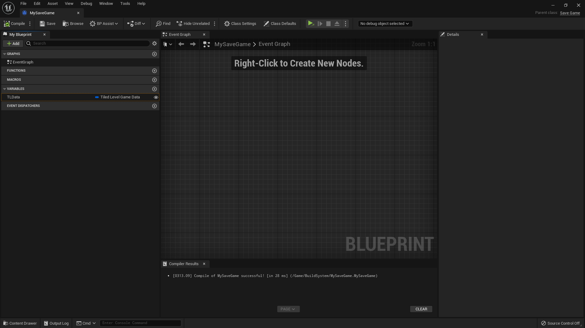
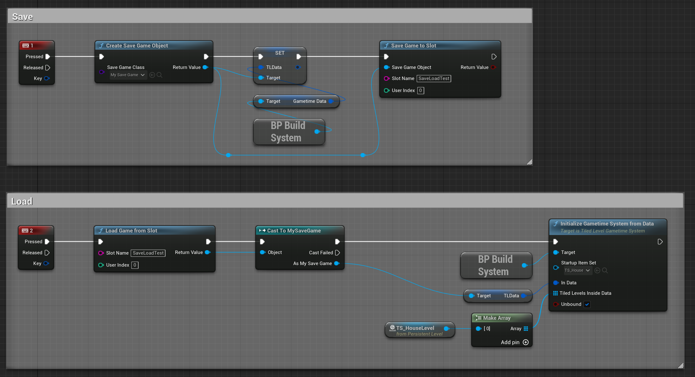

# Tiled level in Gametime - Save & Load

All current placement info is stored in **Gametime Data** (type: **Tiled Level Game Data**) within your **TiledLevelGametimeSystem**. You can just create a **save game object** and add a new variable from type **Tiled Level Game Data** to save it. To load existing saved data, you just call retrieve the data from your save game and call **[InitializeGametimeSystemFromData](Gametime/API/InitializeGametimeSystemFromData)**. Check out [Saving and Loading Your Game](https://docs.unrealengine.com/4.27/en-US/InteractiveExperiences/SaveGame/) if your are not familiar with.

Here's a sample for it's setup:

> (v2.0.1) Call **InitializeGametimeSystemFromData** while is previewing item to build will crash the editor. Fixed was made in dev branch..., will update it soon.
