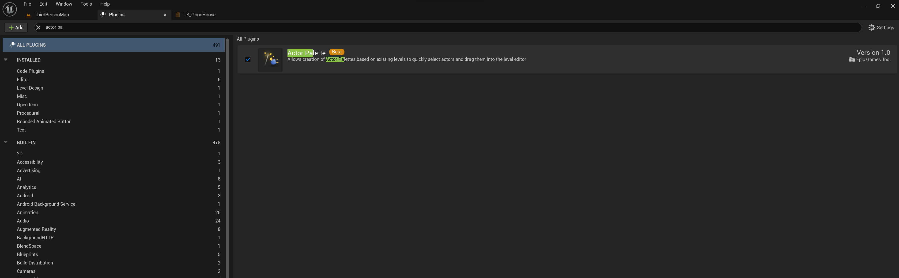
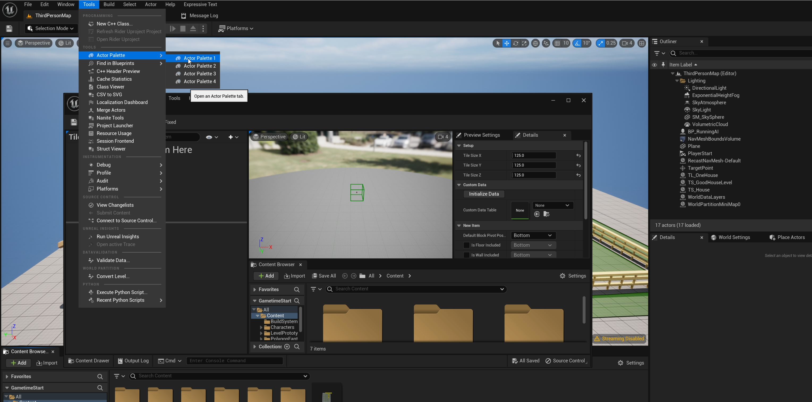
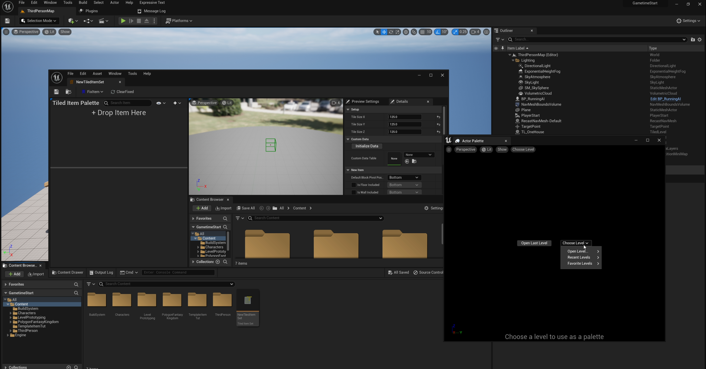
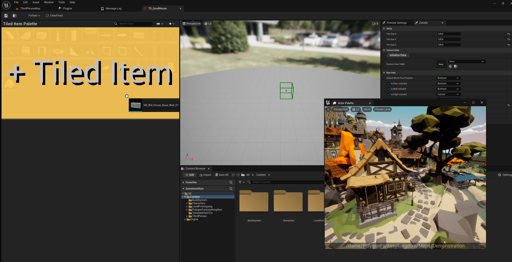

# Asset Pack Tips

> Tips for easier integrate with modular asset packs, make assembling easier.

- Use "Fantacy Kingdom" asset pack from Synty Studios as example
https://www.unrealengine.com/marketplace/en-US/product/polygon-fantasy-kingdom

## 1. Choose a feasible tile size

When using a new asset pack, the first step is to find out a feasible tile size. Open its demonstration map, and check out the size of major structure meshes. In this asset pack, the most feasible tile size is 125 x 125 x 125.

## 2. Use "Actor Palette" plugin to choose which meshes to use

To easier choose asset from hundreds, I would recommend you enable **Actor Palette** to directly pick what you really need. Just open the demonstration map in **actor palette**, and drag the mesh you like to the item set.

## 3. Adjust item origin

Most origin issues should be fixed with a proper anchor point, however, in case it's not fixed, manually adjust translation with a **multiplier of tile size**. Do not set translation adjustment with weird values. There exist solid reasons for the assets to set with these origins. If you just set it randomly, the asset could not perfectly align with others.

## 4. Duplicate asset if necessary

When one modular asset is used with a few different scales repeated during assembling, duplicating that asset with different scales and then treat them as different tiled items would be better.  

