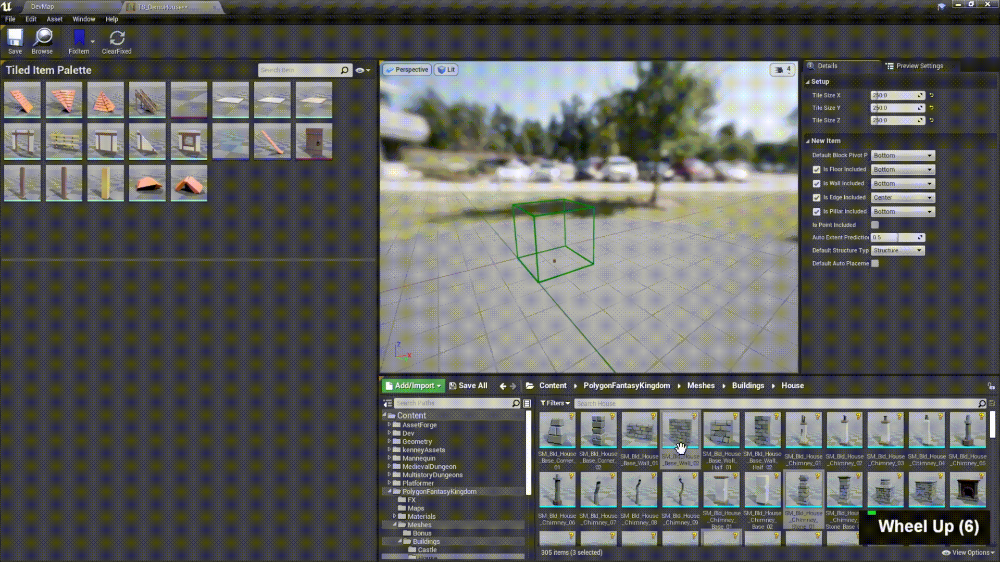

# Setup Item Set

Item Set is a place where you register meshes or actors to tiled items, defines your rule to paint each item.
An item set can be used in multiple tiled level as long as the tile size is the same.

Tiled Item Set Editor Layout:

## 1. Item Set Detail

### Tile Size
**Tile size** is the most important value to set. It depends on how your modular assets are designed.

### New Item Settings

These value will just affect **auto-prediction** for the placed type and extent of new items, save you time to change them latter.
Since you may add hundreds of new item at the same time, these will save you a bunch of time.

## 2. Tiled Item Palette

### Search and View Option

Filter registered items.

### Registered items / Drop region

Drag mesh / actor from content browser to here will register new items to this item set. 

 
### Preview and start to setup each item

Select item to preview how this item placed inside the tiled brush based on its current setting.  

### Item Detail

Modify the detail of selected item.  One can also select mutiple items to modify.

#### Mesh / Actor

The source mesh / actor of this item.

#### Tiled Item

These will make a lot impact on painting, not allowed to change except here.  

- Extent  
  The number of tiles this item occupied.

- Placed Type  
  Includeing **block**, **floor**, **wall**, **edge**, **pillar**, and **point**.

- Structure Type  
  **structure** or **prop**.

Make sure you fully understand the meaning of them. Checkout [Placement Rule](/Guide/PlacementRule). 

#### Auto Placement
Due to the pivot point of each mesh could differ, this will adjust pivot center to geometry center from source mesh.

> You may not want to turn on when the pivot point of source mesh is carefully designed for specific ends. 

#### Anchor Position

The anchor position of item inside the tile. Different placed type would differ in anchor position options.
These options includes: center, bottom, corner, side, and fit.

**Fit** option only appear when auto placement is turn on. It will adjust the traslation and scale to fit the actual tile size.
With fit option selected, you can also override **wall thickness** or **floor height**.

#### Auto Snap
 
Turn on snap to floor to make this item stands right above the floor. Snap to wall is only allowed for wall-prop. 

[Auto Snap Demo](/Guide/TiledLevelEditTools?id=-auto-snap-n)

> Auto-placement and auto-snap are only available in **mesh-type** items.

#### Transform Adjustment

If transformation adjustment from auto placement and anchor position does not still position you item in a perfect way, this is the place for final adjustment.

## 3. Editor Toolbar
####  Fix Item

Fix current seleted preview item in preview viewport at given positions around the next selected preview item. May help you setup item properly.

####  Clear Fixed:

Rmove all preview items fixed in viewport.

## 4. Preview Scene Viewport

Preview seleted item. 

## 5. Content Browser

A normal content browser. 
