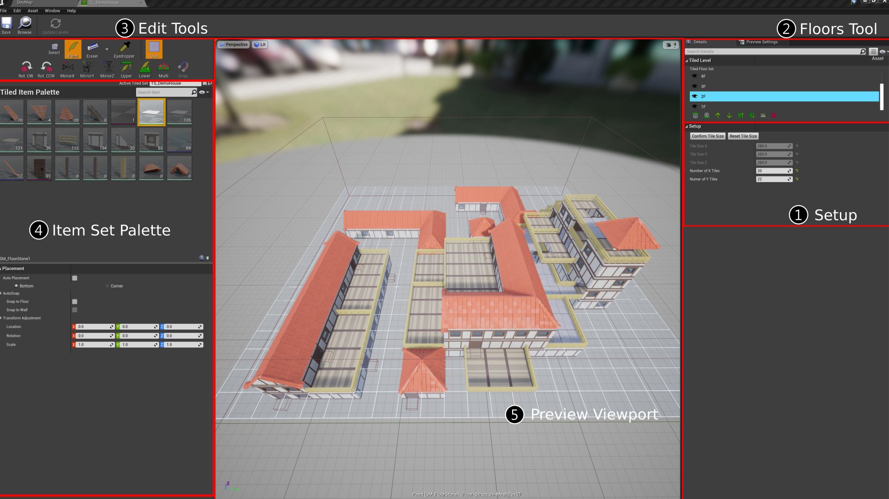
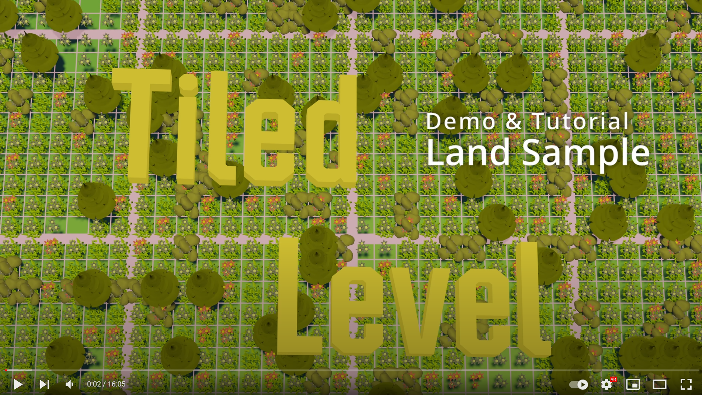

# Tiled Level Edit Tools

Tiled level plugin provide these tools to edit the placement of your items. Should make this process way easier.

## Tiled Level Editor Layout

## 1. Setup

"Reset tile size" so that to set different tile size, and the hit "Confirm".
All painting process will be blocked if tile size not confirmed.  
Set the number of tiles in X and Y axis. You are not allowed to paint outside this area.  

## 2. Floor Tool

A layer system implemented in 3D world. Paint items on active floor.

#### Tiled Floor List
Select floor to edit, you can also **hide / unhide** floor. Right click on any floor will open advaced action menu.

####  Add New Floor Above / Below
Create new empty floor above / below, the position of the rest floors will change accordingly.

####   Move Floor Up / Down
Move selected floor up / down, along with all placements within.

####  Move All Floors Up / Down
Move all floors up / down.

#### Duplicate Floor 
Duplicate selected floor above, along with all placements.

#### Delete Floor 
Delete selected and all its placment.

## 3. Edit Tools

### Edit modes
#### Select (G)
**Shift + right mouse drag** to select placements in "active floor" inside the box selection area. With placements selected, you can paste them where you want with **left mouse click** or **shift + right mouse drag** again to select different area. You can switch to select mode in paint mode with **shift + right mouse drag**. 

#### Paint (B)
Paint select item to active floor with left mouse click.  
You can also drag paint by holding left mouse buton.

**Strait**: While holding **Ctrl** during drag paint, it will force the brush move only hertical or horizontal manner.  
**Quick Eraser**: Holding **Shift** will enter quick eraser mode, it will only easer selected item, which are most likely the ones you just paint. 

#### Eraser (E)
Select which placed type to ease.  
Set the easer extent.  
Set whether allowed to erase for each individual item.  

#### Eyedropper (X)
Make you easier to swich between item to paint. Hover the placement you've painted, and left mouse click to select it to paint.

---

#### Step Control
Options to control step size and origin of grid movement when painting. 

> When most of your items are of extent 2x2, you may want to set step size as 2, and set back to step size as 1 only when you need to paint some items with extent 1x1.  

#### Grid (Tab)
Toggle the visibility of bounding area box and floor grid.

---

####  Rotate (Q/R)
Rotate item 90&deg; in paint mode. (Q: Counter-clock wise / R: Clock wise)

####  Mirror (1/2/3)
Mirror item in paint mode (1: X / 2: Y / 3: Z axis)
> Mirrored item is less performance-efficient. Since the "Hierarchical Instanced Static Mesh Component" does not support negative scale, I could only implement this funtion by spawning static mesh actors instead.

####  Edit Upper / Lower (Z/C)
Move to upper/Lower floor if exist.

####  Multi Mode (M)
Allows you to bypass all placement rules. Just place the item to that position without any replacement operation.

####  Auto Snap (N)
You can toggle this button to enable/disable snap mode (only when the item is set to snap to floor or wall). 

Snap to floor

Snap to wall

## 4. Item Set Palette

- You can change different item set as long as the tile size is the same.

- Some tranformation settings of selected item are allowed to set here. Changing settings won't affect those already painted.

## 5. Preview Viewport

This is where you paint items.

---

