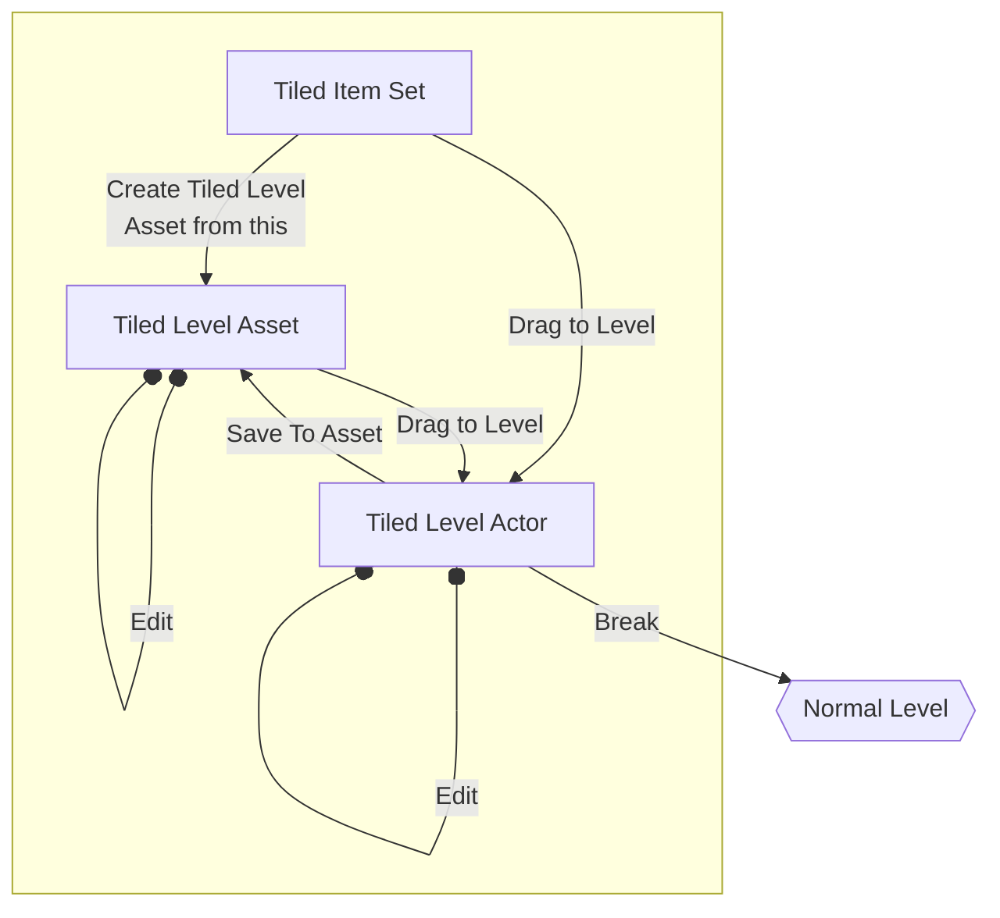

# Workflow

### Break Tiled level

You can always return normal level design workflow after using this plugin. By breaking tiled level, it is converted to separated static mesh actors or BP actors which allows you to fine tuning their properties. They are organized in each floor folders, which enable you to hide specific floors.

### Merge Tiled level

You can convert tiled level asset to static mesh now!
There are three places where you can execute this command:
1. Right click on the tiled level actor on your map.
2. Right click on the tiled level asset on content browser.
3. Click the new toolbar button on tiled level editor.

> LOD and simple collisions will be setup automatically. No worries.  
> All static mesh components in actor-based tiled item placed in your tiled level asset will also be merged to single static mesh.
So far, it doesn't support conversion from instanced static mesh components or procedural mesh components in your actor-baseed tiled item.

