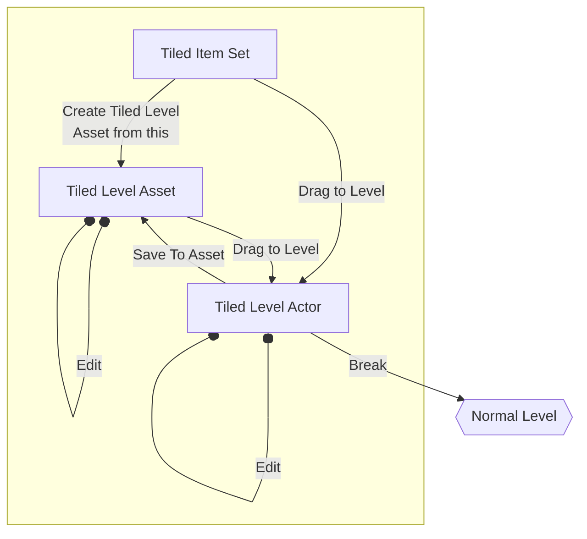

# Workflow

 

### Break Tiled level

You can always return normal level design workflow after using this plugin. By breaking tiled level, it is converted to separated static mesh actors or BP actors which allows you to fine tuning their properties. They are organizd in each floor folders, which enable you to hide specific floors.

Break

