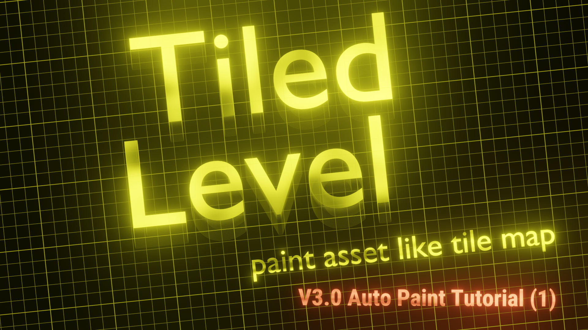

# AutoPaint

### What is auto paint for?

> an solution to spawn meshes / bluerpints automatically based on the rules you defined.

In many cases, modular assets are designed with some particular adjcency rules in mind. Some assets should just be left of some assets. If you can define these adjacency rules, then, maybe we can just draw a region on your map we want it to be land, building, forest, and etc, then let the adjacency rules handle the rest of it.

> The logic behind it is totally from [LDTK](https://ldtk.io/). I just port it to fit 3D environments, and the framework of this plugin.

### Tutorial 1 - soil and plants

### Tutorial 2 - land
Coming soon!
