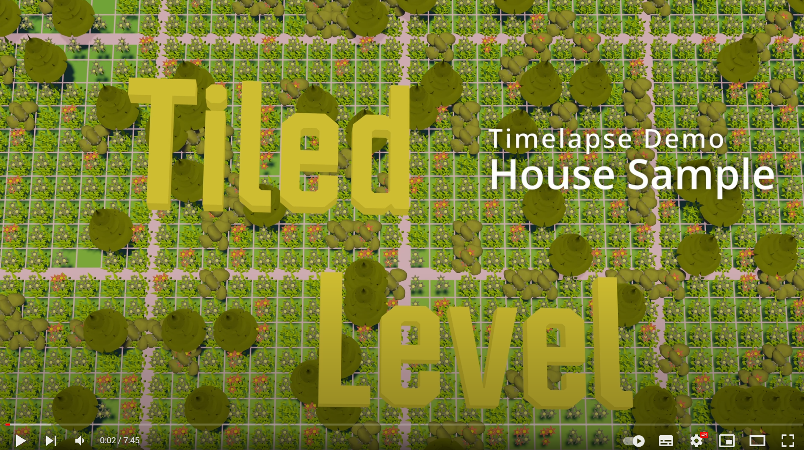
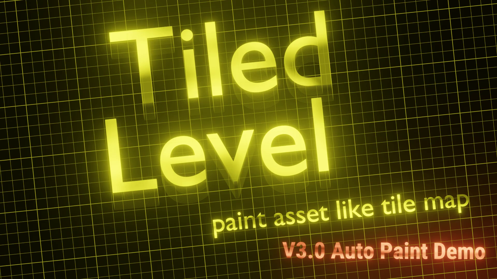

# What it is

 Tiled level plugin is a level design tool in unreal engine that allows you to paint modular assets directly. Setup tiled item set from your static mesh or actor, and you are ready to paint these 3D assets like a 2D tile map. Makes level design from modular assets way easier and intuitive and prototypes your design idea way faster.

 <!-- Watch this timelapse deom for what it is for.  -->

<!--  -->

# New feature: Auto Paint

In many cases, modular assets are designed with some particular adjcency rules in mind. Some assets should just be left of some assets. If you can define these adjacency rules, then, maybe we can just draw a region on your map we want it to be land, building, forest, and etc, then let the adjacency rules handle the rest of it. That is the gist of this new feature.

Here's a demo to compare different way to assemble modular assets and quick glance for functionality in Tiled Level 3.0:

These similar functionality already exist in a tool 2D level design tool called [LDTK](https://ldtk.io/), and I just port it to tiled level.

## When To Use
* Level design for tiled based game
* Assembling modular asset
* Quick prototyping 

# Features
* **Tiled Item Set** (custom asset & editor) to set up, preview, and manage item palette to paint.
* **Tiled Level Asset** (custom asset & editor) to store placement data on all floors. 
* **Tiled Level EdMode** A whole new editor mode to handle the painting process. Painting tools include select, paint, erase, eyedropper, rotation, mirror, and auto-snap.
* **Floors system** A 2D layer system implementation in the 3D world. Allows you to move, hide, duplicate, and delete placements from the same floor together.
* Allow directly edit tiled level on map.
* Performance efficient than normal workflow. (All placements are stored in instanced manner)
* Easily break tiled level into separate static meshes and actors for detail fine-tuning each placement.
* **Gametime support** expose all above feature to runtime so that you can easily create a build system based on it!.
* Create your adjcency rules to automate generate meshes for you.

Getting started with:

> [Land Sample](/QuickStart/LandSample)  
> [House Sample](/QuickStart/HouseSample)

